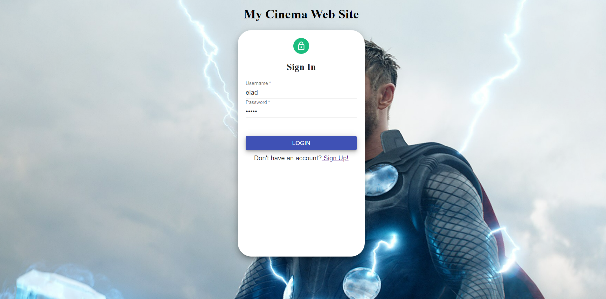

# Cinema Website

---
### Table of Contents
- [Description](#description)
- [How To Use](#how-to-use)
- [Author Info](#author-info)

---
## Description
A website where cinema employees can subscribe anyone and everyone to any movie in the website's database. The website's database holds a number of movies drawn from an API and more can be added if you have the right permissions. Like the movies, the customers (members) are also drawn from a fake API and more members can be added to the database as well. The website holds a record of which member went to which movies and how many people watched a certain movie. The website works with permissions and each employee has a number of permission that give him the ability to view, create, update and/or delete certain data. The Website also has an admin that can manage users (employees) - deleting, editing and adding new users to the database.
#### Technologies
- Frontend: HTML, Javascript, CSS, React, Redux.
- BackEnd: Nodejs, Express, Mongoose
- Database: MongoDB

[Back To The Top](#read-me-template)

---
## How To Use
1. Clone the repository.
2. Run the servers by running the command: 'node main.js' in 2 terminals - one for the UsersDB folder and one for SubscriptionsDB folder.
3. Run the React App by entering the command: 'npm start' in the terminal of 'my-project' folder
#### Installation
1. Nodejs - (https://nodejs.org/en/download/current/)
2. MongoDB Community server - (https://www.mongodb.com/try/download/community)
3. MongoDB GUI: MongoDB Compass or Robo 3T - (https://www.mongodb.com/products/compass) or (https://robomongo.org/)

[Back To The Top](#read-me-template)

---
## Author Info

- LinkedIn - [Elad Ayaso](https://www.linkedin.com/in/eladayaso/)

[Back To The Top](#read-me-template)
